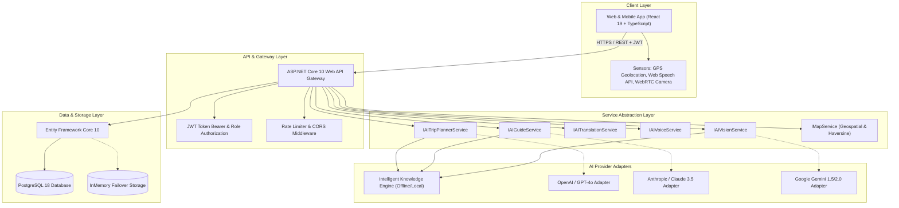

# 🏛️ SAFAR AI — System Architecture Document

> **“Your AI Guide. Your Language. Your Journey.”**

---

## 1. Executive Architectural Overview

SAFAR AI is architectured as a modern, decoupled full-stack tourism intelligence platform designed for high availability, low latency mobile execution, and multi-modal AI interactions (Vision, Voice, Chat, Translation, and Geospatial Navigation).

---

## 2. Layer Descriptions

### 2.1 Presentation Layer (`/frontend`)
- **Technology**: Vite, React 19, TypeScript, Vanilla CSS design tokens with glassmorphic aesthetics.
- **Geospatial UI**: Leaflet & React-Leaflet with CartoDB Voyager tiles and custom SVG pulse pins.
- **Audio & Media**: Web Speech Synthesis API with custom progress soundwave visualizer, Web Speech Recognition for voice translation.
- **Computer Vision**: WebRTC camera stream analyzer with HUD target overlay.
- **Localization**: 10 distinct locales (Uzbek, English, Russian, Turkish, German, French, Spanish, Chinese, Japanese, Korean) with responsive RTL/LTR readiness.

### 2.2 API Layer (`/backend/SafarAi.Api`)
- **Framework**: ASP.NET Core 10 Web API (C# 13).
- **Controllers**:
  - `AuthController`: User registration, secure bcrypt authentication, token claims.
  - `DestinationsController` & `PlacesController`: Rich historical catalogs, nearby queries.
  - `TripsController`: User trip persistence and day-by-day activity tracking.
  - `AiController`: Planner, tour guide, translation, speech synthesis, vision scan.
  - `RoutesController`: Multi-modal transit time and cost estimator.
  - `AdminController`: Aggregated analytics, tourist country breakdown, system health metrics.

### 2.3 Domain Core (`/backend/SafarAi.Core`)
- Contains all pure domain entities, enums (`UserRole`, `TravelStyle`, `TransportMode`, `PlaceCategoryType`), DTO records, and decoupled service interfaces (`IAIService`, `IMapService`, etc.).
- Free of third-party infrastructure dependencies.

### 2.4 Infrastructure & Database (`/backend/SafarAi.Infrastructure`)
- **ORM**: Entity Framework Core with Npgsql driver for PostgreSQL.
- **Failover Resilience**: Graceful failover to in-memory storage if remote PostgreSQL service is offline during local development.
- **Seeding Engine**: `DbInitializer` populates complete Timurid architectural landmarks for Samarkand (Registan, Gur-e-Amir, Shah-i-Zinda, Bibi-Khanym, Siyob Bazaar, Konigil, etc.).

### 2.5 Services & AI Knowledge Engine (`/backend/SafarAi.Services`)
- Implements pluggable AI provider abstractions.
- Features an offline-ready **Intelligent Knowledge Engine** specifically calibrated with Samarkand historical facts, coordinates, pricing, and 10-language translations.
