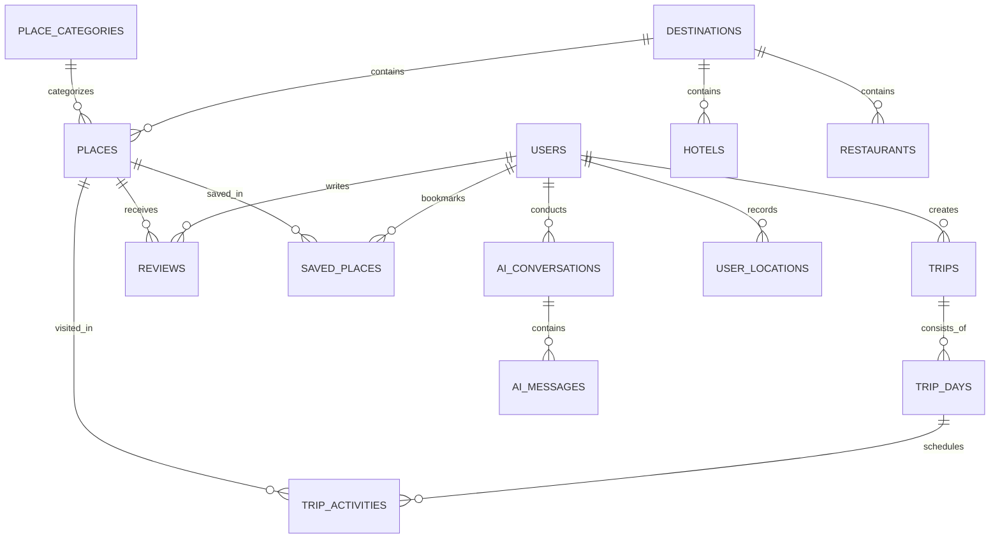

# 🗄️ SAFAR AI — Database Architecture & Data Dictionary

Database Engine: **PostgreSQL 18** (with EF Core 10 ORM)

---

## 1. Entity-Relationship Diagram

---

## 2. Table Specifications

### `Users`
- `Id` (UUID, PK)
- `Name` (VARCHAR(100))
- `Email` (VARCHAR(150), Unique)
- `PasswordHash` (TEXT, BCrypt)
- `Country` (VARCHAR(100))
- `PreferredLanguage` (VARCHAR(10))
- `Role` (INT: 1=User, 2=Admin, 3=Business)

### `Destinations`
- `Id` (UUID, PK)
- `Name` (VARCHAR(100)) — e.g. Samarkand, Bukhara, Khiva, Tashkent
- `Region` (VARCHAR(100))
- `Latitude`, `Longitude` (DOUBLE PRECISION)
- `PopularityScore` (INT)

### `Places`
- `Id` (UUID, PK)
- `Name` (VARCHAR(150)) — e.g. Registan Square
- `LocalName` (VARCHAR(150)) — Registon Maydoni
- `DestinationId` (UUID, FK -> Destinations)
- `CategoryId` (UUID, FK -> PlaceCategories)
- `ShortDescription`, `DetailedHistory`, `ArchitectureDetails` (TEXT)
- `InterestingFacts` (JSON Array)
- `Latitude`, `Longitude` (DOUBLE PRECISION)
- `TicketPriceUzs` (DECIMAL(18,2))
- `AudioGuideScript` (TEXT)
- `VisionRecognitionTags` (TEXT)

### `Trips`, `TripDays`, `TripActivities`
- Hierarchical relation capturing custom AI-generated journeys with scheduled time slots, transit modes, distance deltas, and estimated itemized expenses.

### `Reviews`
- Place reviews from verified tourists with 1-5 star ratings, feedback, and home country.
